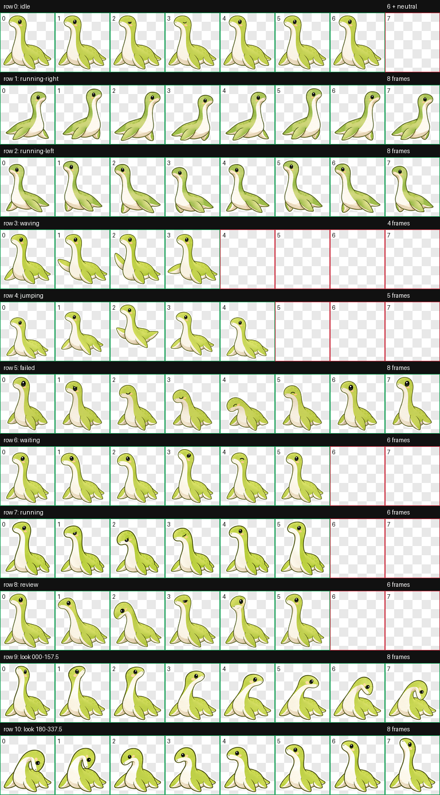
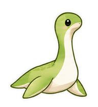
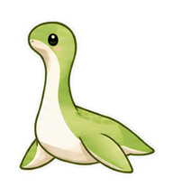

# Nessie Desktop Pet for Codex

[中文](README.md) · [日本語](README.ja.md) · [English](README.en.md)

A Codex v2 animated desktop pet inspired by the *Apex Legends* Nessie concept. It is a light olive-green, sticker-style plesiosaur with a cream belly, dark olive outlines, and glossy black bead eyes.

## Included files

| Path | Purpose |
| --- | --- |
| `assets/Nessie-v2-pet.zip` | Ready-to-install Codex v2 package. |
| `assets/spritesheet.webp` | Lossless transparent 1536×2288 sprite atlas. |
| `assets/pet.json` | Pet manifest with `spriteVersionNumber: 2`. |
| `assets/previews/` | Idle and directional GIF previews. |
| `assets/qa/` | Contact sheet and validation reports. |
| `source/` | Browsable prompts, export script, and reproduction notes. |
| `Nessie-source-artifacts.zip.part-*` | Split parts of the complete image-source archive; concatenate them into a ZIP. |

## Install in Codex

1. Download and extract `assets/Nessie-v2-pet.zip`.
2. Copy `pet.json` and `spritesheet.webp` to `~/.codex/pets/nessie/`.
3. Restart Codex and choose **Nessie** in Pet Settings.

The atlas contains 8 columns × 11 rows at 192×208 pixels per cell. Rows 0–8 hold the standard animation states; rows 9–10 provide 16 clockwise look directions.

## Animation and QA

The pet includes idle, running-right, running-left, waving, jumping, failed, waiting, running, and review states. The final build repairs dark head shading in the movement rows, a left-facing tail boundary cut, malformed flippers, and blue chroma-key fringes in GIF exports.

Final checks confirm valid v2 geometry and transparency; zero visible blue-key pixels and zero alpha-mask mismatches after decoding all nine GIFs. Left-running frames are mirrors of complete registered right-running cells, which preserves the cadence and a clean tail silhouette.

See `assets/qa/`, `assets/creation-notes.md`, and `assets/repair-notes.md` for the evidence.

## Source and reproducibility

`source/` keeps the prompts, export script, and reproduction notes. The complete image-source set—character references, generated strips, extracted frames, final PNG/WebP atlases, and QA evidence—is stored in `Nessie-source-artifacts.zip.part-*`. Download every part, run `cat Nessie-source-artifacts.zip.part-* > Nessie-source-artifacts.zip` on macOS/Linux, then extract the ZIP for offline review or reproduction.

Please retain the attribution notes when redistributing the supplied character references, prompts, or final artwork.
